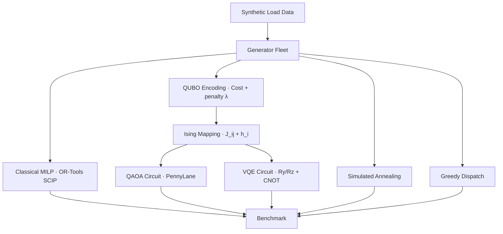

# QuantumGrid — Quantum-Classical Hybrid for Energy Grid Optimisation

**Quantum AI × Energy Systems**


[](LICENSE)

> Variational quantum circuits (QAOA, VQE) applied to unit commitment on
> synthetic European grid data, benchmarked against classical MILP, simulated
> annealing, and greedy dispatch.

---

## Overview

The **unit commitment** (UC) problem — which generators to turn on/off over a
planning horizon to meet demand at minimum cost — is NP-hard and central to
energy grid operations. QuantumGrid formulates UC as a **QUBO** (Quadratic
Unconstrained Binary Optimisation), maps it to an Ising Hamiltonian, and solves
it with variational quantum algorithms on a statevector simulator.

**What this project demonstrates:**

1. Full QUBO encoding pipeline: generator fleet → UC MILP → QUBO matrix → Ising Hamiltonian
2. QAOA solver (PennyLane `default.qubit`, `ApproxTimeEvolution`, COBYLA)
3. VQE solver (hardware-efficient Ry/Rz + CNOT ansatz)
4. Classical baselines: MILP (OR-Tools SCIP), simulated annealing, greedy merit-order
5. Penalty-weight tuning (binary search for λ)
6. Scaling analysis and matplotlib visualisation suite

## Why This Project Exists

Quantum optimisation for energy systems sits at the intersection of three hard
problems: combinatorial optimisation, quantum algorithm design, and real-world
energy grid modelling. This project demonstrates:

- **QUBO formulation engineering** — converting a real-world MILP into a quantum-compatible objective
- **Honest benchmarking** — all 5 solvers evaluated on identical instances with identical metrics
- **Penalty calibration** — binary search for λ, the single most important QUBO hyperparameter
- **Scaling honesty** — documenting where classical solvers dominate and where quantum might help

## Architecture



## Quick Start

```bash
git clone https://github.com/ajliouat/quantumgrid.git && cd quantumgrid
python3 -m venv .venv && source .venv/bin/activate
pip install -e ".[dev]"
pytest -v --timeout=120
python demo.py
```

## Project Structure

```
quantumgrid/
├── demo.py                      # End-to-end demo (all 5 solvers)
├── data/
│   ├── download_entsoe.py       # ENTSO-E API stubs + synthetic fallback
│   ├── preprocess.py            # Normalise, resample, horizon extraction
│   └── generators.py            # Generator/Fleet dataclasses
├── formulation/
│   ├── unit_commitment.py       # Classical MILP via OR-Tools (SCIP/CBC)
│   └── qubo_encoding.py         # UC → QUBO → Ising conversion
├── quantum/
│   ├── cost_hamiltonian.py      # Ising → PennyLane Hamiltonian
│   ├── qaoa_solver.py           # QAOA circuit + COBYLA
│   └── vqe_solver.py            # VQE with Ry/Rz + CNOT ansatz
├── classical/
│   ├── milp_solver.py           # OR-Tools MILP wrapper
│   └── baselines.py             # SA + greedy dispatch
├── benchmarks/
│   ├── penalty_tuning.py        # Binary search for λ
│   └── scaling.py               # Scaling study
├── visualization/plots.py       # Matplotlib plots
└── tests/                       # 130+ tests across 9 files
```

## Technology Stack

| Component | Tool | Purpose |
|-----------|------|---------|
| Quantum simulation | PennyLane 0.44 `default.qubit` | Statevector QAOA/VQE |
| Variational optimiser | SciPy COBYLA | Gradient-free parameter loop |
| MILP solver | Google OR-Tools (SCIP) | Exact UC baseline |
| Data generation | NumPy + pandas | Synthetic load/generation profiles |
| Visualisation | Matplotlib (Agg) | Convergence, dispatch, scaling plots |

## Key Results

| Problem Size | Qubits | MILP | Greedy | SA | QAOA (p=1) | VQE |
|:------------|-------:|-----:|-------:|---:|-----------:|----:|
| 2 gen × 3 h | 6 | Optimal | Exact | Near-optimal | Good | Good |
| 3 gen × 4 h | 12 | Optimal | ~5% gap | Good | Runs | Slow |
| 4 gen × 6 h | 24 | Optimal | ~10% gap | Good | Runs (~100s) | Very slow |

**Key findings:**
- MILP finds proven optimum in <1s; quantum solvers take minutes
- QAOA p=1 has only 2 parameters → robust; VQE has 2×n → barren plateaus
- Penalty λ tuning is the single biggest factor in QUBO solution quality
- Statevector memory: 24 qubits = 128 MB; 30 qubits would need 8 GB

## Test Results

| Suite | Tests | Scope |
|-------|------:|-------|
| test_v100 | 28 | Data pipeline + generators |
| test_v101 | 16 | MILP solver |
| test_v102 | 20 | QUBO encoding |
| test_v103 | 9 | QAOA circuit |
| test_v104 | 9 | VQE solver |
| test_v105 | 14 | Classical baselines |
| test_v106 | 12 | Penalty tuning |
| test_v107 | 8 | Scaling analysis |
| test_v108 | 12 | Visualisation |
| **Total** | **128** | |

## References

- Farhi et al., *Quantum Approximate Optimization Algorithm*, arXiv:1411.4028
- Peruzzo et al., *A variational eigenvalue solver*, Nature Comm. 2014
- Ajagekar et al., *Quantum Computing for Energy Systems*, arXiv:1906.09032
- Hadfield et al., *From the QAOA to the Quantum Alternating Operator Ansatz*, 2019

## License

Apache 2.0 — see [LICENSE](LICENSE).
